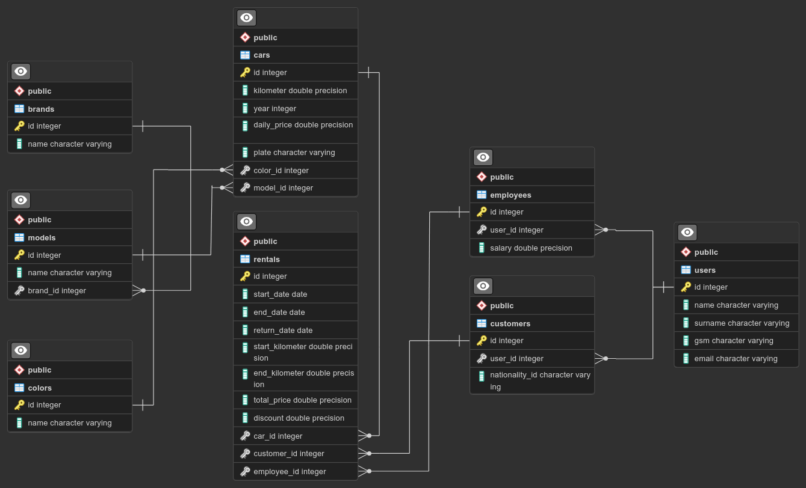

# DELTA RENTAL
## *Java - React Fullstack Developer Rent A Car Project*
## *Tobeto - İstanbul Kodluyor* 


***********************************************************

# Araba Kiralama Projesi

Bu proje, araç kiralama işlemlerini yönetmek amacıyla geliştirilmiş bir yazılımdır. Projemiz, kullanıcıların kolayca araç kiralayabilmeleri ve araçları takip edebilmeleri için çeşitli özellikleri içermektedir.

## Amaç

Projenin temel amacı, kullanıcıların sistemden istedikleri marka, model, renk seçeneklerine sahip arabaları 
kiralayabilecekleri
günlük kiralama ücretini, kiralama başlangıç ve bitiş tarihlerini öğrenebilecekleri 
ve belirtilen adresten araçlarını
teslim alabilecekleri süreci takip etmektir.


## Projede Çalışanlar

Bu projeyi geliştiren ekip:

- **Onurcan Şenel**
- **Rıdvan Gürsoy**
- **Merve Keser**

Ekip üyeleri, yazılım geliştirme konusundaki uzmanlıklarıyla bir araya gelerek başarılı bir iş ortaya koymuştur.

## Kullanılan Teknolojiler
[](https://skillicons.dev)

## DataBase ER Diagramı


## Kurulum

Projeyi yerel bilgisayarınıza klonlamak ve çalıştırmak için aşağıdaki adımları izleyebilirsiniz:

1. Repoyu bilgisayarınıza klonlayın:

    ```bash
    git clone https://github.com/mervekeser/delta-rental.git
    ```

2. Proje dizinine gidin:

    ```bash
    cd delta-rental
    ```

Uygulama başarıyla başladıktan sonra http://localhost:8080 adresinden projeyi görüntüleyebilirsiniz.

## Katkıda Bulunma

Eğer projemize katkıda bulunmak istiyorsanız, lütfen bir çekme talebi oluşturun. Katkılarınızı bekliyoruz!


## Proje Versiyonları

- <a href = "https://github.com/mervekeser/delta-rental/commits/main/">**Pair 6 Proje Çalışması 2 Commits (13.12.2023) Version-1.0.0 ve Aşağısı** </a>
- <a href = "https://github.com/mervekeser/delta-rental/commits/main/">**Pair 6 Proje Çalışması 3 Commits (15.12.2023) Version-1.0.1 ve Aşağısı** </a>